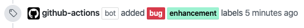

# Action Add Labels

[![actions-workflow-test][actions-workflow-test-badge]][actions-workflow-test]
[![release][release-badge]][release]
[![license][license-badge]][license]



This is a GitHub Action to add GitHub labels to an issue or a pull request.

This action extract the number from an issue or a pull request which has triggered this by default.
It means you don't need to care about something annoying like whether you should use `${{ github.event.issue.number }}` or `${{ github.event.pull_request.number }}`.

It would be more useful to use this with other GitHub Actions' outputs.

## Inputs

|      NAME      |                                           DESCRIPTION                                           |   TYPE   | REQUIRED |                                     DEFAULT                                     |
| -------------- | ----------------------------------------------------------------------------------------------- | -------- | -------- | ------------------------------------------------------------------------------- |
| `github_token` | A GitHub token.                                                                                 | `string` | `true`   | `N/A`                                                                           |
| `labels`       | The labels' name to be removed. Must be separated with line breaks if there're multiple labels. | `string` | `true`   | `N/A`                                                                           |
| `number`       | The number of the issue or pull request.                                                        | `number` | `false`  | `N/A`                                                                           |
| `repo`         | The owner and repository name. e.g.) `Codertocat/Hello-World`                                   | `string` | `false`  | `${{ github.event.issue.number }}` or `${{ github.event.pull_request.number }}` |

## Example

### Add a single label with a comment

```yaml
name: Add Label

on:
  issues:
    types: opened

jobs:
  add_label:
    runs-on: ubuntu-latest
    steps:
      - uses: actions/checkout@v2
      - uses: actions-ecosystem/action-add-labels@v1
        if: ${{ startsWith(github.event.comment.body, '/add-labels') }}
        with:
          github_token: ${{ secrets.github_token }}
          labels: bug
```

### Add multiple labels with a comment

```yaml
name: Add Labels

on:
  pull_request:
    types: opened

jobs:
  add_labels:
    runs-on: ubuntu-latest
    steps:
      - uses: actions/checkout@v2
      - uses: actions-ecosystem/action-add-labels@v1
        if: ${{ startsWith(github.event.comment.body, '/add-labels') }}
        with:
          github_token: ${{ secrets.github_token }}
          labels: |
            documentation
            changelog
```

## License

Copyright 2020 The Actions Ecosystem Authors.

Action Add Labels is released under the [Apache License 2.0](./LICENSE).

<!-- badge links -->

[actions-workflow-test]: https://github.com/actions-ecosystem/action-add-labels/actions?query=workflow%3ATest
[actions-workflow-test-badge]: https://img.shields.io/github/workflow/status/actions-ecosystem/action-add-labels/Test?label=Test&style=for-the-badge&logo=github

[release]: https://github.com/actions-ecosystem/action-add-labels/releases
[release-badge]: https://img.shields.io/github/v/release/actions-ecosystem/action-add-labels?style=for-the-badge&logo=github

[license]: LICENSE
[license-badge]: https://img.shields.io/github/license/actions-ecosystem/action-add-labels?style=for-the-badge
